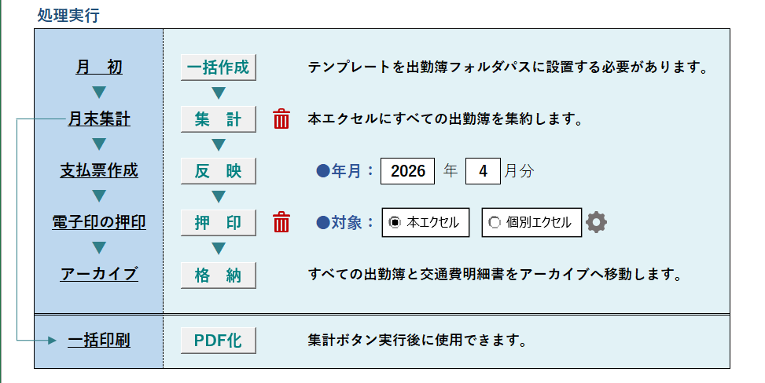
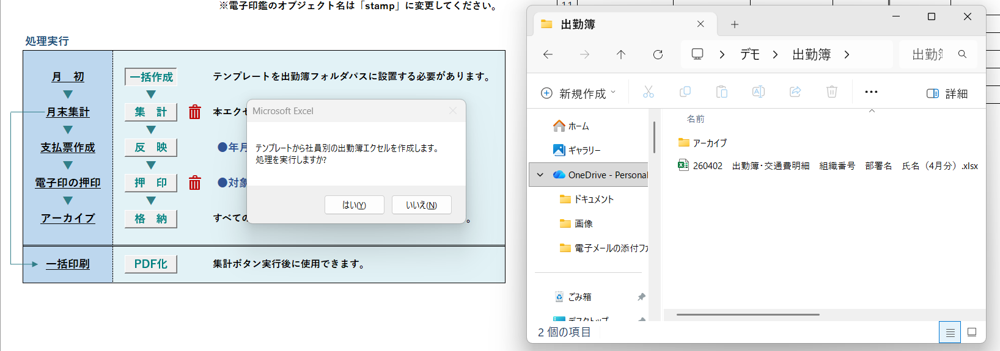
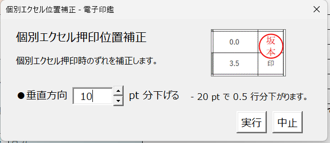

# 出勤関連処理システム（Sampleデータあり）

## 概要
- テンプレートを元に個人別の出勤簿エクセルを一括作成します。
- 入力フォームから出勤をする仕組みにより、誤字脱字を防ぐツールです。
- 個人別の出勤簿を集計し、電子印鑑の一括押印など、指定の提出形式に整えます。

## 主な機能
- 社員一覧のリストを元に、個人別のエクセルファイル作成
- 入力フォームから個人別のエクセルファイルに出勤情報を反映
- 個人別のエクセルファイルから出勤情報を集計・出力
- 電子印鑑の一括押印

## 技術ポイント
- 処理のほとんどに確認ダイアログを設置
- Dirによるファイル操作
- Shapeオブジェクト操作による電子印鑑のループ押印
- 集計したシートを配列に格納後、PDF出力処理

## スクリーンショット
### 出勤登録画面
　

### 管理画面
  

### 個人別の出勤エクセル一括作成
  

### 電子印の押印
  

### 押印位置の調整
  
  
